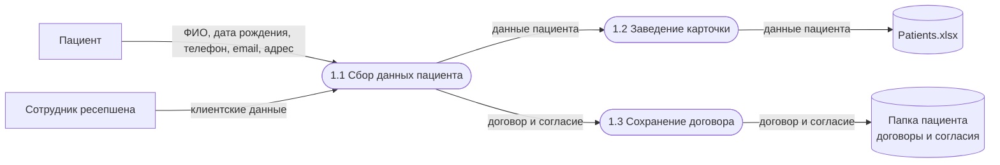
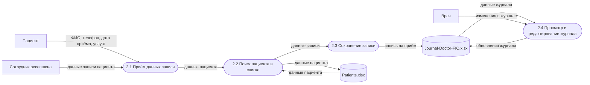
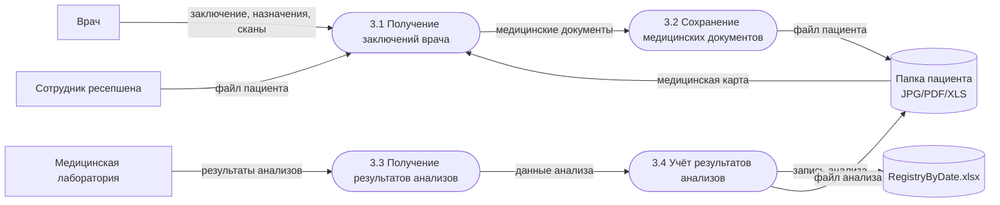
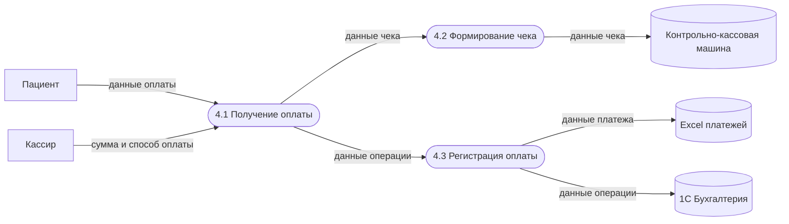
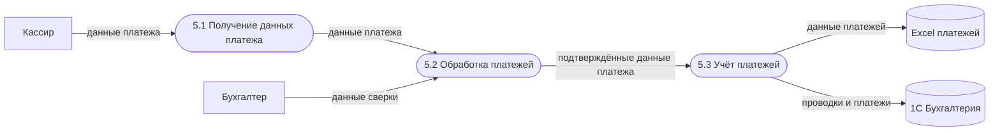
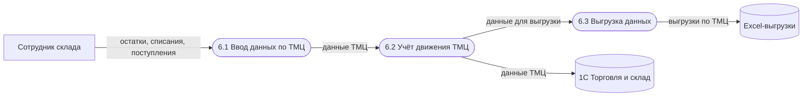

# 1. Выявление конфиденциальных данных

## Данные

| Процесс | Данные | Тег |
|---|---|---|
| 1. Регистрация пациента в системе | ФИО, дата рождения, телефон, электронная почта, адрес прописки, клиентские контракты, договоры и согласия | `PII` (персональные данные) |
| 2. Запись пациента к специалисту | ФИО, телефон, дата приёма, услуга, журнал записей к специалистам | `PII`, `PHI` (персональные и медицинские данные) |
| 3. Ведение медицинской карты и учёт анализов | медицинские карты, результаты анализов, заключения, JPG, PDF, сканы | `PHI` (медицинские данные) |
| 4. Принятие оплаты | данные оплаты, сумма и способ оплаты, данные чека | `FIN` (финансовые данные) |
| 5. Процессинг платежей | данные платежей, данные сверки, проводки и платежи | `FIN` (финансовые данные) |
| 6. Учёт ТМЦ | учёт товарно-материальных ценностей, закупки оборудования для медицинских кабинетов | `INV` (данные склада и ТМЦ) |

## Неучтённые данные

| Данные | Тег |
|---|---|
| Факт обращения пациента в клинику как отдельная чувствительная сущность | `PHI` (медицинские данные) |
| Статус согласия на обработку ПДн | `PII` (персональные данные) |
| Заключения специалистов, хранящиеся на общем диске вне отдельной системы учёта | `PHI` (медицинские данные) |
| Переписка с пациентом через Exchange Mail Server / Outlook | `PII` (персональные данные) |
| Данные лаборатории в промежуточных файлах и ручном вводе | `PHI` (медицинские данные) |
| Audit-логи действий пользователей по файлам и Excel | `SEC` (технические данные безопасности) |

## DFD As-Is

### 1. Регистрация пациента в системе

### 2. Запись пациента к специалисту

### 3. Ведение медицинской карты и учёт анализов

### 4. Принятие оплаты

### 5. Процессинг платежей

### 6. Учёт ТМЦ

