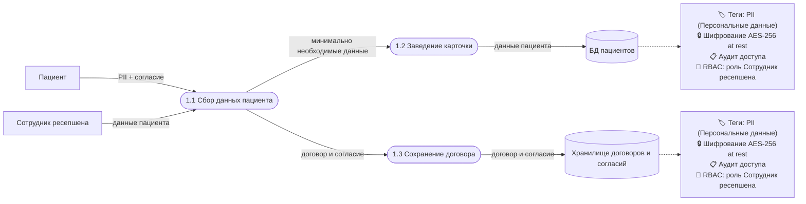
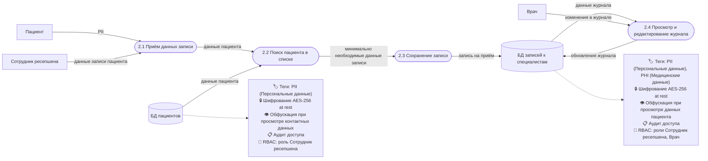
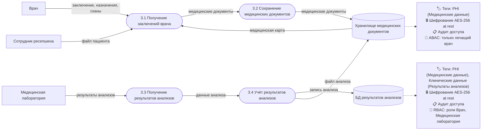
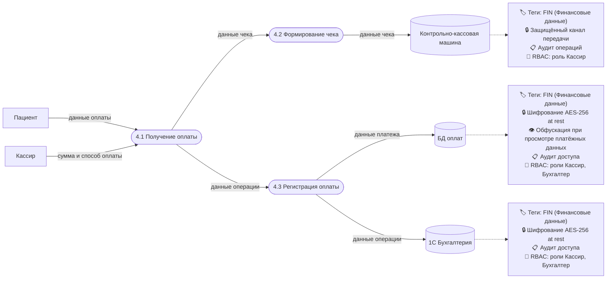
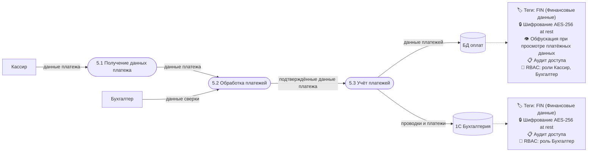
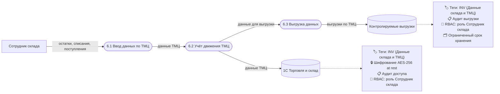

# 3. Что можно улучшить

## Данные для защиты и способы защиты

| Данные | Шифрование | Обфускация | Обезличивание |
|---|---|---|---|
| ФИО, дата рождения, телефон, электронная почта | Да | Да | Да |
| Адрес прописки, место работы или учёбы | Да | Да | Да |
| Клиентские контракты, договоры и согласия | Да | Нет | Нет |
| Журнал записи к специалистам | Да | Да | Да |
| Медицинские карты, заключения, результаты анализов | Да | Нет | Да |
| JPG, PDF, сканы | Да | Нет | Частично |
| Данные оплаты, сумма и способ оплаты, данные чека | Да | Да | Да |
| Данные платежей и проводки | Да | Да | Да |
| Данные ТМЦ и закупок | Да | Нет | Нет |
| Audit-логи и логи доступа | Да | Нет | Да |

## Механизм тегирования данных

### Теги

| Тег | Назначение |
|---|---|
| `PII` (Персональные данные) | ФИО, телефон, email, адрес |
| `PHI` (Медицинские данные) | Медкарта, диагноз, анализы, заключения |
| `Клинические данные` (Результаты анализов) | Результаты анализов |
| `FIN` (Финансовые данные) | Платежи, чеки, проводки |
| `INV` (Данные склада и ТМЦ) | ТМЦ, закупки, выгрузки |
| `raw_lab_results` (Сырой источник) | Первичные результаты анализов |
| `verified_lab_results` (Обработанные данные) | Проверенные результаты анализов |
| `lab_analytics` (Используется для аналитики) | Данные для BI/ML/AI |

### Правила тегирования

1. Тег ставится в момент создания записи, загрузки файла или поступления данных из внешнего источника.
2. Тег определяет, какие меры применяются: шифрование, архивация, удаление, маскирование, обезличивание.
3. Теги `PII`, `PHI`, `FIN` используются для ограничения доступа и проверки ролей через RBAC.
4. Теги `raw_lab_results`, `verified_lab_results`, `lab_analytics` используются для Data Lineage.
5. Данные с тегом `lab_analytics` можно использовать в BI/ML/AI после обезличивания.

### Инструменты тегирования

| Этап | Инструмент |
|---|---|
| Начальный этап | Ручная разметка данных и реестр тегов |
| Обнаружение и классификация данных | BigID, Informatica |
| Управление согласиями | OneTrust, DataGrail |
| Data Lineage и метаданные | Collibra, Apache Atlas |
| Автоматический мониторинг тегов | BigID, Informatica, Collibra |

## Инструменты, способы и меры защиты

| Направление | Что использовать |
|---|---|
| Контроль доступа | RBAC, ABAC, Least Privilege |
| Защита данных at rest | Шифрование файлов, дисков, БД |
| Защита данных in transit | TLS, защищённые каналы передачи |
| Защита данных in use | MFA, журналирование действий, ограничение доступа к рабочим местам |
| Работа с файлами | DLP, контроль метаданных, контроль тегов |
| Управление согласиями | Реестр согласий, OneTrust, DataGrail |
| Audit Trail | Централизованные журналы доступа и изменений |
| Data Lineage | Collibra, Apache Atlas, карта потоков данных |
| Data Minimization | Сбор только минимально необходимого набора данных |
| Аналитика | Обезличивание перед передачей в BI/ML/AI, тег `lab_analytics` |

## DFD To-Be

### 1. Регистрация пациента в системе

### 2. Запись пациента к специалисту

### 3. Ведение медицинской карты и учёт анализов

### 4. Принятие оплаты

### 5. Процессинг платежей

### 6. Учёт ТМЦ

