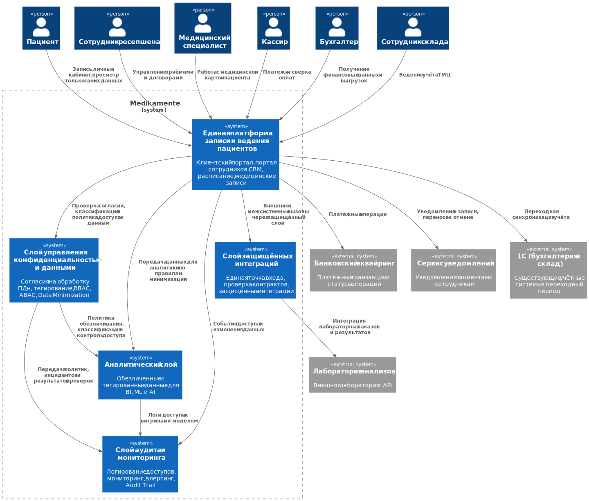

# 2. Проектирование решения

## Новые блоки целевой архитектуры

| Блок | Назначение | Privacy by Design |
|---|---|---|
| Клиентский портал | Самостоятельная запись на приём, просмотр только своих данных, получение уведомлений | Privacy by Default, Least Privilege |
| Портал сотрудников | Работа ресепшена, врачей, кассиров, бухгалтерии и склада в едином контуре | Privacy by Design, RBAC, ABAC |
| Единая платформа записи и ведения пациентов | Работа с пациентами, расписанием, медицинскими данными, договорами и оплатами | Data Minimization, End-to-End Security |
| Слой управления конфиденциальностью и данными | Согласия, классификация, тегирование, RBAC, ABAC, Data Minimization | Privacy by Design, Data Lineage, Privacy by Default |
| Слой защищённых интеграций | Единая точка входа, внешние интеграции, проверка контрактов и защита API | End-to-End Security, Privacy by Default |
| Слой аудита и мониторинга | Audit Trail, мониторинг доступа, алертинг, контроль нетипичных действий | Наглядность и прозрачность |
| Аналитический слой | Изолированный аналитический контур, обезличенные и тегированные данные для BI, ML и AI | Data Minimization, Privacy by Default, Data Lineage |

## Диаграмма контекста C4 To-Be

